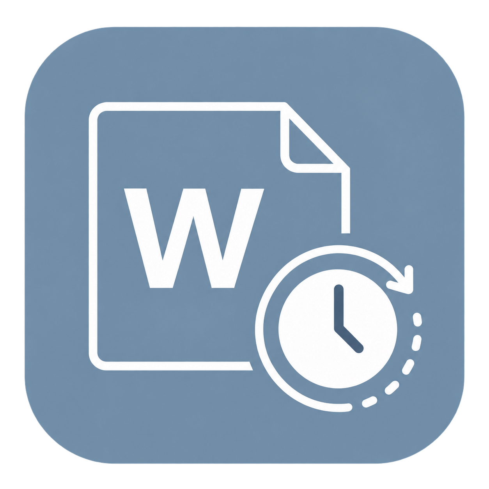

# Word 定时保存助手

一个轻量级 Windows 桌面应用，用于定时保存当前用户会话中可检测到的 Microsoft Word 文档。当前版本 **v1.4.2（自定义图标与署名版）**，窗口标题包含版本号，避免与旧版混淆。

[下载最新版 v1.4.2](https://github.com/HamsterTide/WordAutoSaveAssistant/releases/tag/v1.4.2)。普通用户请下载 `Word定时保存助手-v1.4.2-win-x64.zip`，解压后运行 `Word定时保存助手.exe`；源码压缩包供开发者使用。发布页同时提供 SHA-256 校验清单。便携包内附使用说明、当前验收报告、优化状态与程序校验值。



作者：**LGH**；赞助商：**ZHZ**。署名固定显示于界面底部，同时写入程序集元数据；Windows 文件属性的公司字段为 LGH。图标采用用户提供的图片，移除外部网格背景并保留灰蓝色圆角主体；程序文件、窗口、界面标题和托盘使用同一套图标。PNG 和八尺寸 ICO 均嵌入程序，无需外置图片。v1.4.2 未改动保存、检测、定时和权限逻辑。

v1.4.1 仅实施已确认的优化 1、2、3：设置目录或文件无法写入时，本次运行仍使用所选间隔，并显示非阻断警告；文档清单区分符合保存条件、有修改、跳过、文档异常和无法连接；连接提示区分已确认权限差异、忙碌、拒绝访问及对象模型不可用。保存调度仍每 250 毫秒检查，但倒计时只在显示秒变化时更新；停止时不反复完整刷新，托盘隐藏时不刷新控件，恢复后立即同步最新状态。状态画刷冻结并复用。

## 使用方法

1. 双击 `Word定时保存助手.exe`。
2. 输入保存间隔（1–1440 分钟，默认 10 分钟）。
3. 点击“开始”。应用会立即检查并保存一次，之后按设定间隔执行。
4. 点击“停止”可随时结束定时任务；停止本身不会触发保存。

“立即保存一次”只执行一轮：停止状态下不会启动定时，运行状态下不会改变原来的下一轮时间。保存或忙碌等待期间按钮暂不可用，不会叠加保存任务；停止状态下执行单次保存时，“停止本次”可取消后续处理和等待。

应用每次重新打开都保持“已停止”，只记住时间间隔。最小化后会进入系统托盘并继续运行；双击托盘图标可恢复窗口。运行中关闭应用会先询问是否停止并退出。

打开后即显示“当前文档”清单，**检测不会保存**。主窗口可见、未锁屏且未休眠时约每 10 秒自动刷新，也可点击“刷新列表”。列表显示名称、可取得的完整路径，以及待保存、无未保存修改、只读、未命名、受保护、无法连接等状态。保存执行期间不会叠加检测；最小化后停止列表轮询，定时保存仍继续。

“符合保存条件”包含已有路径、非只读且未受保护的文档，无修改时无需调用保存；“有修改”是其中检测到未保存修改的数量。“跳过”与读取/保存异常分别统计，不能把异常当成跳过。无法连接项不是已获取的文档，不代表其中仅有一份文档。保存轮次与当前只读检测各自显示时间；实时清单不是已经成功保存的名单。

## 保存规则

- 每轮先按可见 Word 窗口获取原生对象模型并按 COM 身份去重，再使用活动对象和运行对象表补充无窗口/旧版注册路径，以覆盖同时打开的多个 Word 实例。
- **不限制主显示器，也不只保存当前活动窗口**：枚举同一桌面上所有显示器的 Word 窗口，再遍历每个可连接实例的全部文档。后台、被其他窗口遮挡和最小化的文档也在范围内；不模拟 Ctrl+S、不切换文档、不抢焦点。
- 先固定本轮文档引用，再逐份保存；COM 身份引用保留到枚举处理结束，避免指针重用误去重。单份文档失败不会阻止其他文档处理。
- 某个 Word 窗口无法连接时不再静默漏掉，而是按窗口列入“失败”及最近记录；同一进程只要其他窗口已成功连接，就不会重复报告偶发的窗口级失败。
- 仅对已有保存路径、非只读、未受保护且 Word 标记为有修改的文档执行普通 `Save`。
- 未命名、只读或受保护的文档会被跳过，不会调用 `SaveAs`，也不会关闭 Word。
- 成功时静默运行；跳过项显示在主窗口本次会话记录中；失败时另外显示托盘通知。
- 调用 `Save` 后再次读取 Word 的 `Saved` 状态；未得到确认时明确列为失败，不伪报成功。
- Word 返回可识别的忙碌错误（`0x80010001` / `0x8001010A`）时，先继续处理其他文档，再等待 5 秒，对忙碌项延迟重试一次。仍然忙碌或其他错误会明确列为失败；只读检测不会进行这次延迟重试。
- 停止、锁屏、休眠或退出会取消尚未执行的忙碌重试。若 `Save` 已返回、只是成功确认暂时忙碌，重试只确认状态，不重复调用保存；无法确认时不报告成功。
- 锁屏或系统休眠时不会开始新的保存。解锁或唤醒后合并执行一次检查，并重新开始完整倒计时。

## 结果名单

- “最近一轮结果”按“已保存、无需保存、已跳过、失败”分为四个区域，每项显示文档名。
- 鼠标停留在文档名上可查看可用的完整路径；跳过和失败项还会显示原因及错误代码。
- 同名文档不会合并；每一轮完成后四个区域会整体替换为该轮结果。新一轮执行期间继续保留上一轮名单并显示“正在更新”。
- 四分类在“最近一轮”选项卡中，每个区域更多文档可在区域内滚动。下方仅保留本次运行期间最近 5 条跳过或失败记录。
- 名单和记录只保存在内存中，重新启动后清空；应用仍只持久化保存间隔。

## 运行要求与能力边界

- Windows x64。
- Microsoft Word 桌面版。
- [.NET 8 Desktop Runtime x64](https://dotnet.microsoft.com/download/dotnet/8.0)；本发布包为框架依赖型单文件，不会自行安装运行库。
- 助手与 Word 必须处于同一用户、同一交互桌面。权限差异、Word 未公开桌面对象模型、云端/网络文件状态等都可能导致某些实例保存失败；无法连接的窗口会显示在“当前文档”，保存轮次中也列入“失败”和最近记录。程序只读核对进程完整性级别；能够确认权限差异时，悬停可查看具体提示。**不会自动提权或修改安全设置**。权限对齐需要用户手动处理，处理前这些窗口不能保证自动保存。
- 已进入 Word 的单次 COM 保存无法安全强制中断；点击停止会取消等待并阻止后续保存，但当前调用可能需要等待 Word 返回。打开 Word 对话框等场景可能让 Word 长时间无法响应，延迟重试不是无限等待或强制关闭对话框。
- 应用确认的是 Word 本地保存状态，不承诺 OneDrive 或网络位置已经完成同步。

设置仅保存在 `%LOCALAPPDATA%\Word定时保存助手\settings.json`，不写注册表、不联网、不开机自启、不创建磁盘日志。

设置写入失败时只影响下次启动能否记住新间隔，不影响本次调度；下次启动可能恢复此前已保存的间隔或默认 10 分钟，不会恢复运行状态。之后成功写入会清除设置警告。

## 从源码构建

需要 .NET 8 SDK：

```powershell
dotnet build .\WordAutoSaveAssistant.sln -c Debug -p:Platform=x64 -m:1
dotnet .\tests\WordAutoSaveAssistant.Tests\bin\x64\Debug\net8.0-windows\WordAutoSaveAssistant.Tests.dll
dotnet publish .\src\WordAutoSaveAssistant\WordAutoSaveAssistant.csproj -c Release -r win-x64 --self-contained false -p:PublishSingleFile=true -p:Platform=x64 -o .\发布版-v1.4.2
```

只读检查当前可发现的 Word 实例和文档名（不会调用 `Save`）：

```powershell
dotnet .\tests\WordAutoSaveAssistant.Tests\bin\x64\Debug\net8.0-windows\WordAutoSaveAssistant.Tests.dll --word-discovery --inventory
```

附加的隔离 Word 集成测试必须显式启用：

```powershell
dotnet .\tests\WordAutoSaveAssistant.Tests\bin\x64\Debug\net8.0-windows\WordAutoSaveAssistant.Tests.dll --word-integration
# 附加真实一分钟 DispatcherTimer + COM STA 保存 + DOCX 磁盘内容验证
dotnet .\tests\WordAutoSaveAssistant.Tests\bin\x64\Debug\net8.0-windows\WordAutoSaveAssistant.Tests.dll --word-integration --timed
```

测试只会在确认自动化创建了唯一的新 `WINWORD.EXE` 进程后操作临时文档；否则会安全跳过。

Debug 构建还支持 `--ui-fixture` 界面验收参数。该模式只显示假数据，并禁用“开始”、“立即保存一次”、间隔输入和刷新，绝不会连接 Word；Release 构建不包含此入口。

独立 Debug 界面性能诊断使用相同假数据，预热 3 秒后采样 30 秒，并正常退出，不连接 Word：

```powershell
dotnet .\tests\WordAutoSaveAssistant.Tests\bin\x64\Debug\net8.0-windows\WordAutoSaveAssistant.Tests.dll --ui-refresh-benchmark
```

当前验收报告为 [QA_REPORT-v1.4.2.md](QA_REPORT-v1.4.2.md)。发布包保留了打包时的使用说明；本仓库 README 另增加了 GitHub 下载入口。
